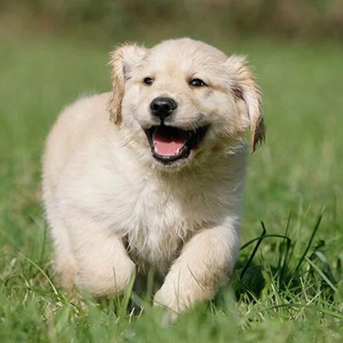
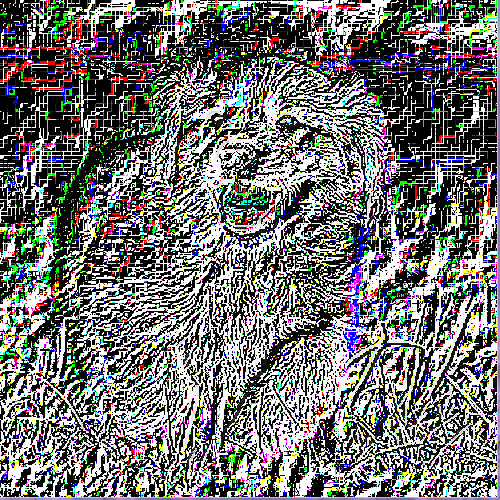

# Image scaling in python
This is a simple program written for "Image and Signal Processing" univeristy course.
It demonstrates How to downscale and upscale an image with nearest neigbour interpolation
and the loss of quality during this process.  

This is the first version so the code should probabbly be refactored
to improve readability.

## Screenshots
### Original image

### Downscaled image

### Upscaled image

### Difference between original and upscaled

